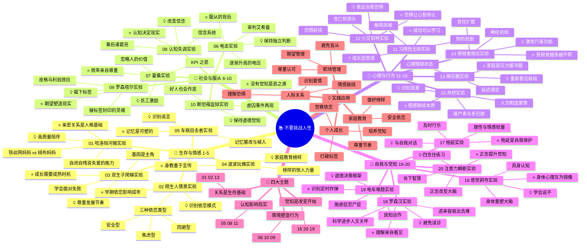
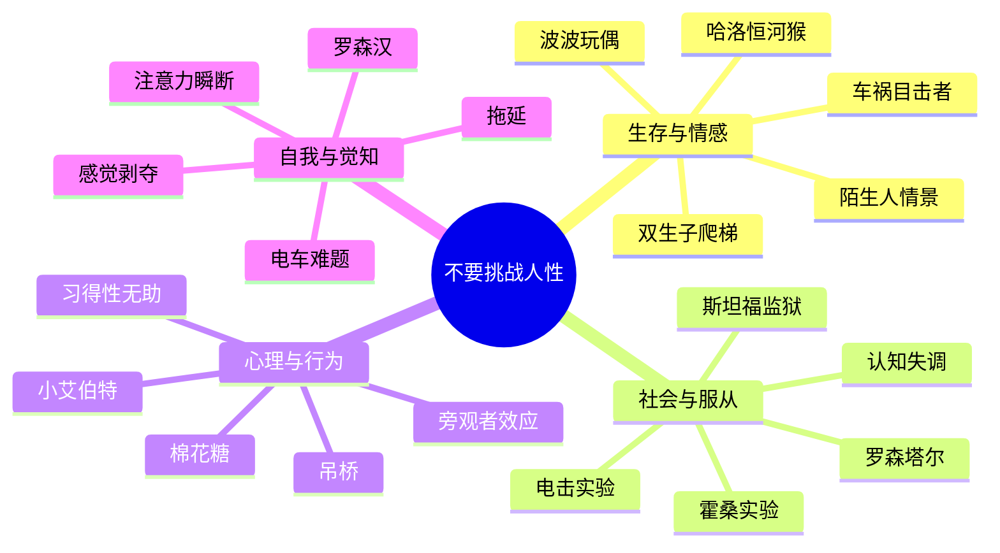
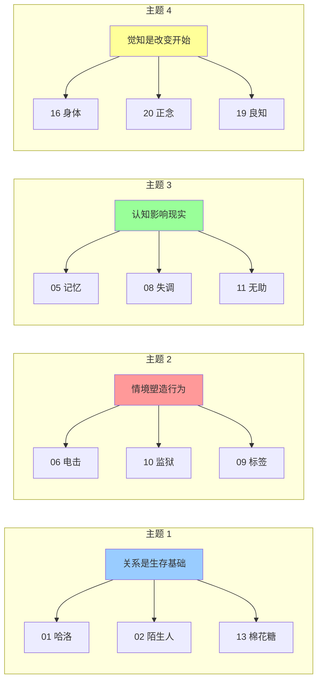
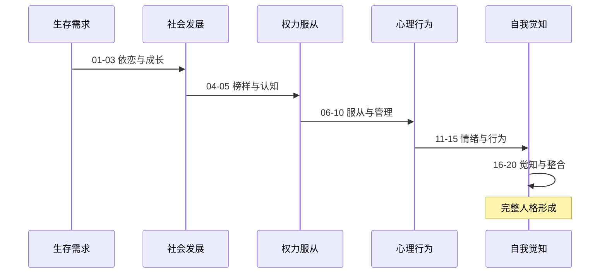
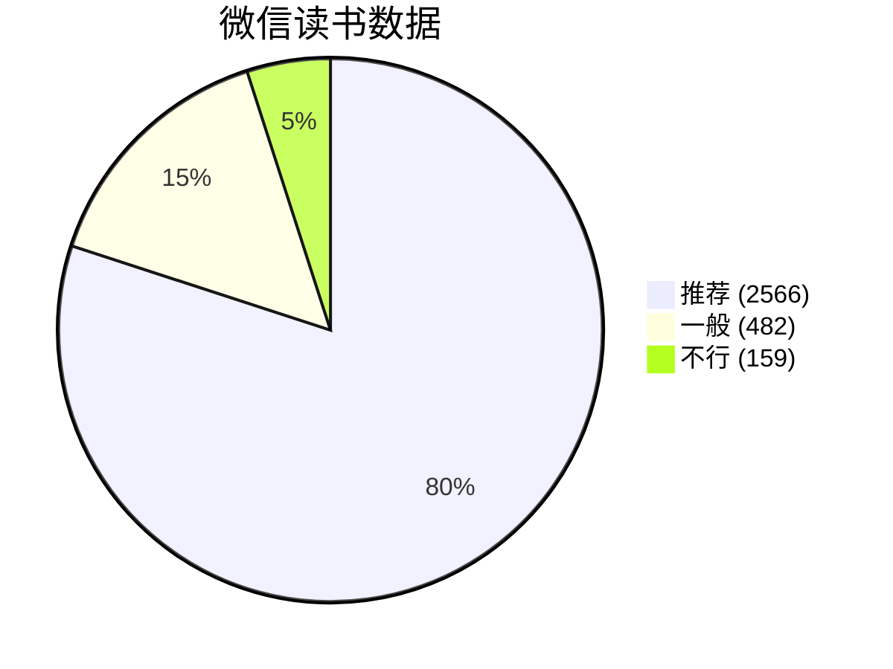

# 不要挑战人性 - 思维导图（Mermaid 格式）

## 使用方法
- 在支持 Mermaid 的 Markdown 编辑器中打开（如 Obsidian、Typora、VS Code）
- 或访问 https://mermaid.live/ 复制粘贴渲染

---

## 完整思维导图



---

## 简化版（四大主题）



---

## 实验关系图

```mermaid
graph TD
    A[📚 不要挑战人性] --> B[🔬 生存与情感]
    A --> C[🔬 社会与服从]
    A --> D[🔬 心理与行为]
    A --> E[🔬 自我与觉知]
    
    B --> B1[01 哈洛恒河猴]
    B --> B2[02 陌生人情景]
    B --> B3[03 双生子爬梯]
    B --> B4[04 波波玩偶]
    B --> B5[05 车祸目击者]
    
    C --> C1[06 电击实验]
    C --> C2[07 霍桑实验]
    C --> C3[08 认知失调]
    C --> C4[09 罗森塔尔]
    C --> C5[10 斯坦福监狱]
    
    D --> D1[11 习得性无助]
    D --> D2[12 小艾伯特]
    D --> D3[13 棉花糖]
    D --> D4[14 旁观者效应]
    D --> D5[15 吊桥]
    
    E --> E1[16 感觉剥夺]
    E --> E2[17 拖延]
    E --> E3[18 罗森汉]
    E --> E4[19 电车难题]
    E --> E5[20 注意力瞬断]
    
    style A fill:#f96,stroke:#333,stroke-width:4px
    style B fill:#bbf,stroke:#333
    style C fill:#fbb,stroke:#333
    style D fill:#bfb,stroke:#333
    style E fill:#ffb,stroke:#333
```



---

## 核心主题关联图



---

## 实验流程递进图



---

## 书籍数据统计



---

## 金句云图（文字云替代）

```
        ╔═══════════════════════════════════════════╗
        ║         不要挑战人性 核心金句              ║
        ╠═══════════════════════════════════════════╣
        ║                                           ║
        ║    ✨ 亲密关系是人格健全的基础             ║
        ║                                           ║
        ║       🌟 没有觉知是最大的作恶之源          ║
        ║                                           ║
        ║    💫 身教的关键在于家长先切身体验         ║
        ║                                           ║
        ║       ⭐ 期望会塑造现实                    ║
        ║                                           ║
        ║    🎯 成功是可以学习的                     ║
        ║                                           ║
        ║       💡 身体与心理互为镜像                ║
        ║                                           ║
        ║    🔥 真正的理解来自看见对方的感受         ║
        ║                                           ║
        ║       🌈 正念打开通往觉知的门              ║
        ║                                           ║
        ╚═══════════════════════════════════════════╝
```

---

*思维导图创建时间：2026 年 3 月 31 日*  
*基于微信读书公开目录整理*
