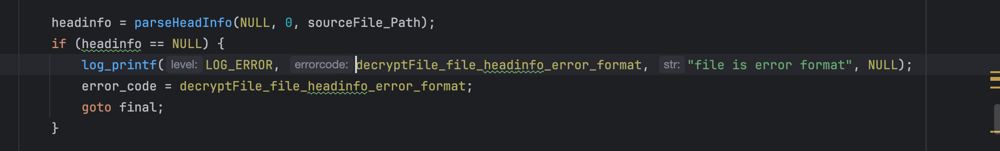

# 4月7日
## 文件透明加密+免改造需求评审

排期

http://10.20.114.45:8090/pages/viewpage.action?pageId=99460703

## ✅ipsec高性能版本前+后端+server端联调

## ✅流水线问题排查和处理

问题：打包失败报错
解决方法：
打包系统重构后有问题，修复后解决

## ✅贵州人社厅vpn现场问题

系统重装失败，根据报错提示，现场的用来安装dasos的启动u盘有问题，重新制作启动·u盘

# 4月8日
## vpn4.2pqc版本测试问题排查和修复
问题描述：
点击"导出许可申请"按钮后台报错

问题分析：
调用的是公共模块的接口。

解决方法：
依赖的公共模块需要升级，升级后解决

## 密盾解密报错20505

问题描述：
用户内部群下载文件失败，但是单聊没问题。

问题分析：
加解密方法是不care单聊、群聊、内部群的。加解密函数只接受消息内容。单聊的内容没有问题，但是内部群的内容有问题。说明内部群的内容格式有问题。

排查过程：
代码中搜索20505，找到相关代码decryptFile_file_headinfo_error_format，

继续搜索decryptFile_file_headinfo_error_format，找到相关代码parseHeadInfo函数。

AI分析parseHeadInfo函数的实现，了解什么情况下会报20505错误。

```markdown
用户在询问关于 `decryptFile_file_headinfo_error_format` 这个错误在什么情况下会出现。这是一个代码搜索问题，我需要在项目中搜索这个错误字符串来找到相关的上下文。
我来搜索这个错误相关的代码。

找到了相关代码。这个错误定义在 native.h 中，并在 safechat.c 中使用。让我查看 safechat.c 中这个错误的上下文，了解什么情况下会报这个错误。
现在我明白了。让我进一步查看 parseHeadInfo 函数，看看什么情况下它会返回 NULL，从而导致这个错误。
我需要查看parseHeadInfo函数的实现，以了解什么情况下会返回NULL导致这个错误。

现在我清楚了。这个错误是在 `parseHeadInfo` 函数返回 NULL 时产生的。让我总结一下会触发这个错误的几种情况。


根据代码分析，`decryptFile_file_headinfo_error_format` 错误会在以下情况触发：

## 触发条件

`parseHeadInfo()` 函数返回 `NULL` 时会报此错误，具体有以下几种情况：

1. **内存分配失败** - malloc 分配 `msg_HandInfo_t` 失败

2. **文件大小过小** - 文件大小 ≤ `sizeof(msg_HandInfo_t)`（文件头结构体大小）

3. **文件打开失败** - 无法以二进制模式打开文件

4. **读取文件头失败** - fread 读取文件头数据失败

5. **文件格式错误** - 文件头的 `magic[0]` 和 `magic[1]` 不匹配预设的 `MAGIC_ONE` 和 `MAGIC_TWO`（魔数校验失败）

6. **参数错误** - 同时传入 `filecontent` 和 `sourcefile` 都为 NULL/空

其中最常见的是第5种情况：**文件格式不合法**，即被解密的文件不是正确的加密文件格式（魔数验证失败）。
```


