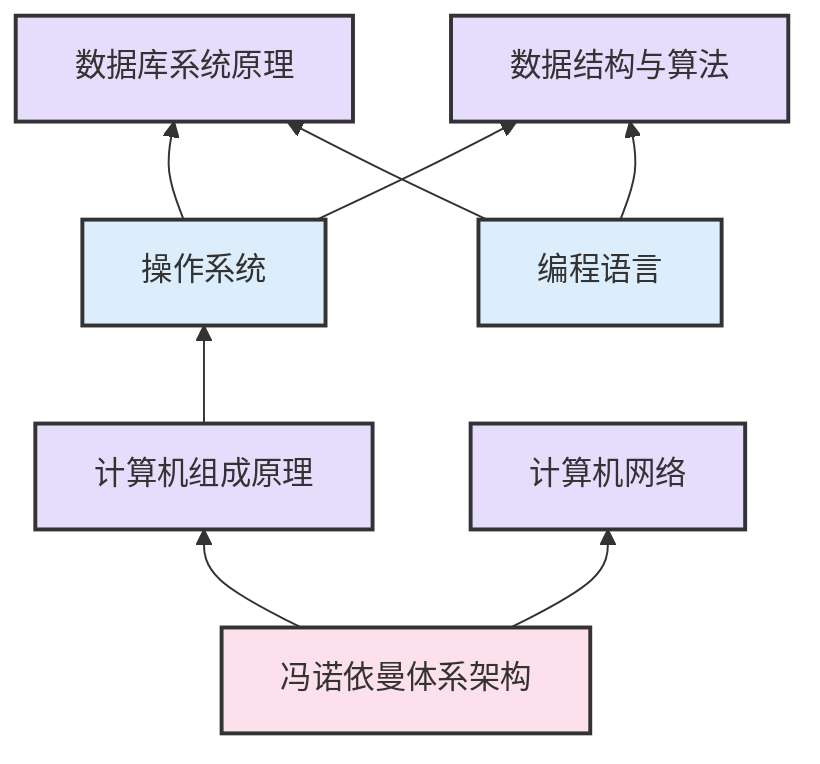

```mermaid
graph BT
    %% 定义节点
    DB[数据库系统原理]
    DS[数据结构与算法]
    OS[操作系统]
    PL[编程语言]
    CO[计算机组成原理]
    CN[计算机网络]
    VN[冯诺依曼体系架构]

    %% 定义连接关系
    VN --> CO
    VN --> CN
    CO --> OS
    OS --> DB
    OS --> DS
    PL --> DS
    PL --> DB

    %% 定义样式类
    classDef purple fill:#e6dcfc,stroke:#333,stroke-width:2px;
    classDef blue fill:#dceefc,stroke:#333,stroke-width:2px;
    classDef pink fill:#fce0ec,stroke:#333,stroke-width:2px;

    %% 应用样式
    class DB,DS,CO,CN purple;
    class OS,PL blue;
    class VN pink;
```