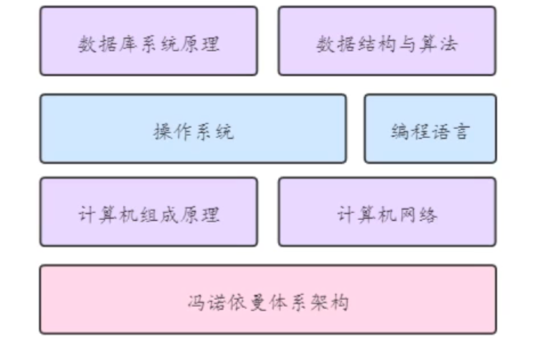
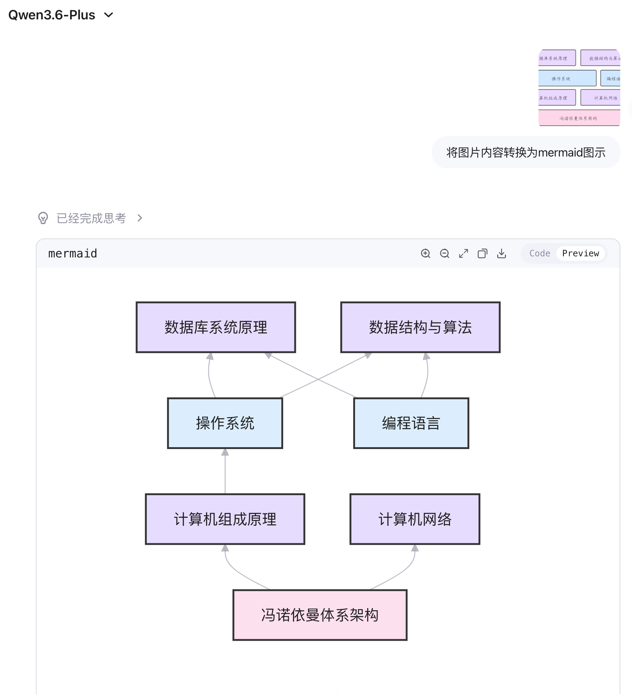
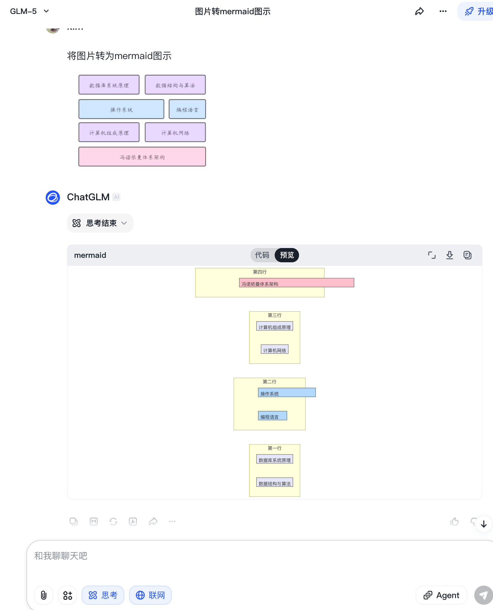
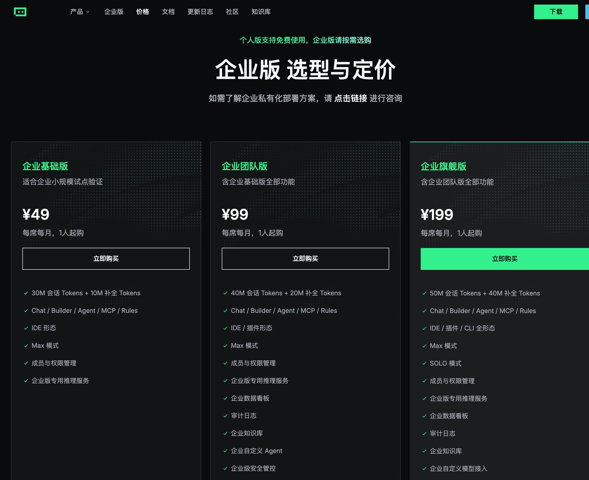
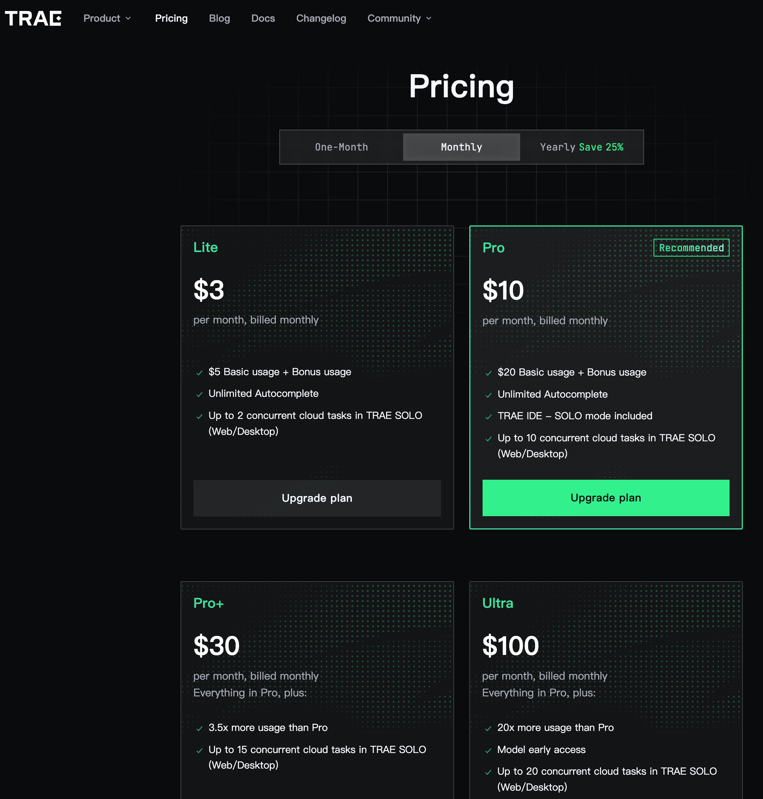
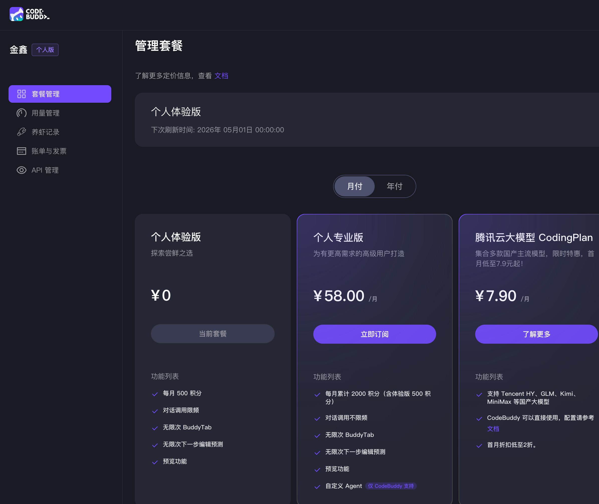
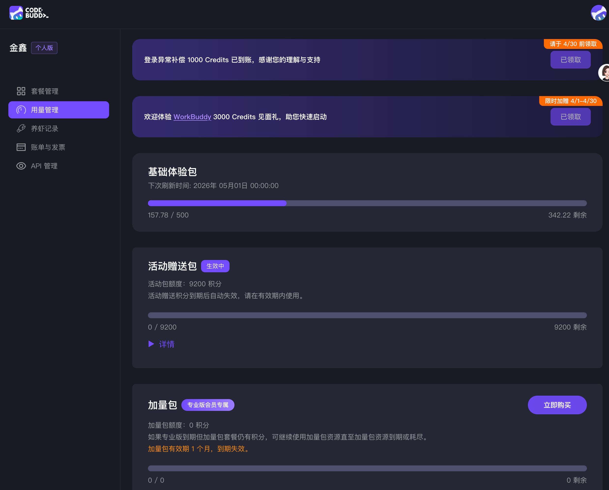
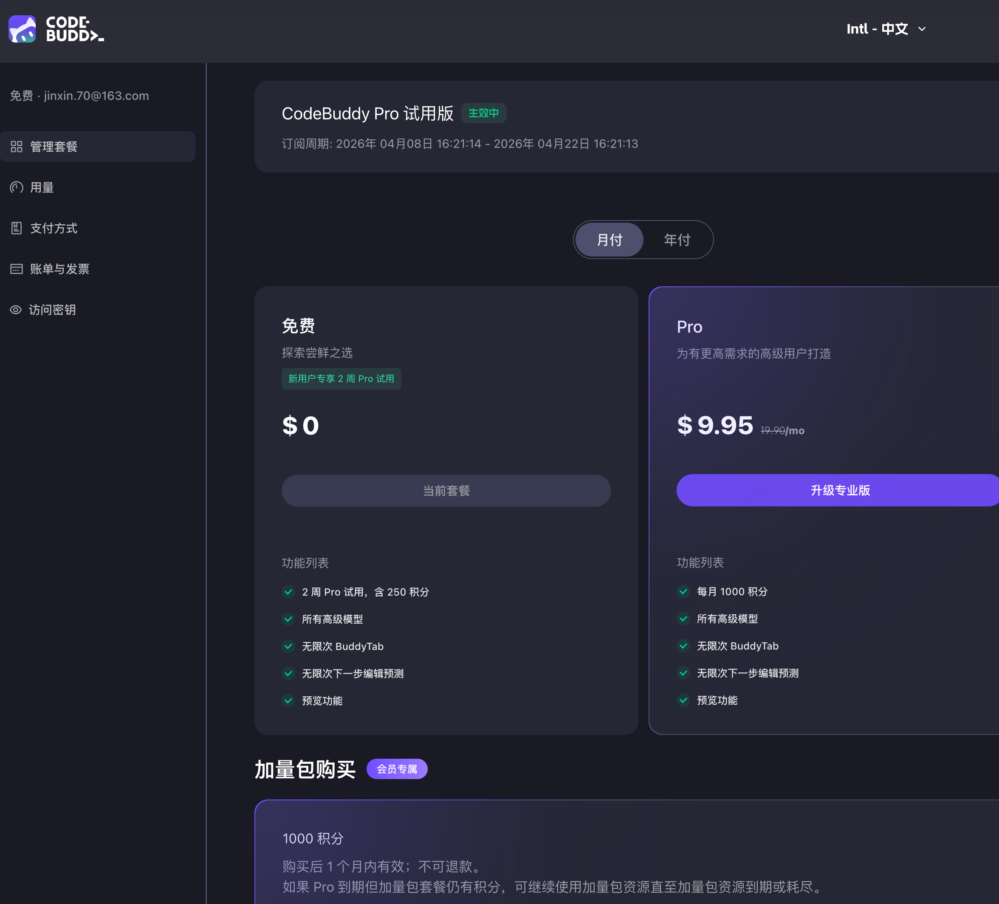
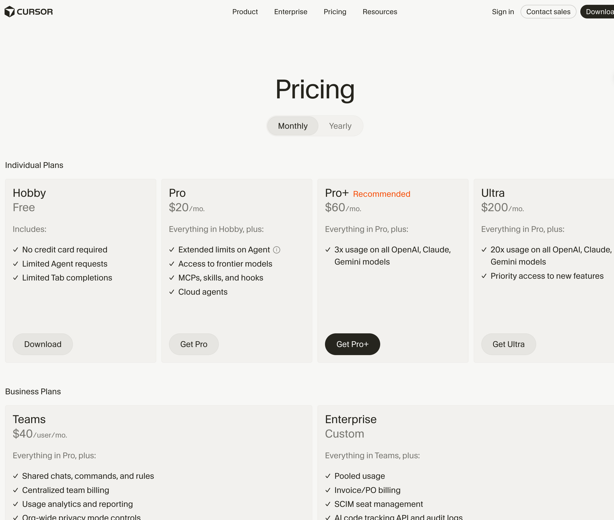
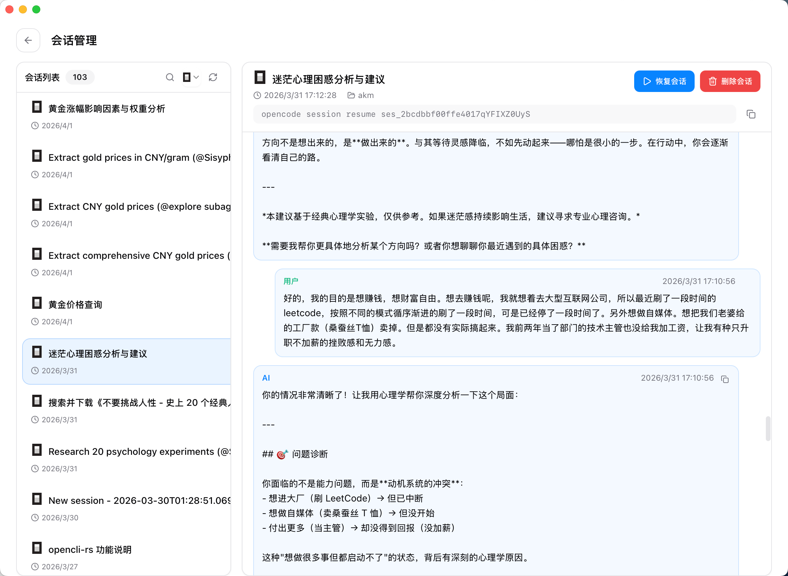

# 4月4日
## 将图片内容转换为mermaid图示


### ✅Qwen3.6-plus（还原度最高，几乎一样）



### ❌智普清言/豆包/deepseek/kimi


# 4月7日

## ✅一键升级agent工具脚本

```
npm i -g opencode-ai
npm i -g oh-my-opencode
npm install -g @anthropic-ai/claude-code
npm install -g @jackwener/opencli
npm install -g bb-browser
curl -fsSL https://pinchtab.com/install.sh | bash
npm install -g @tencent-ai/codebuddy-code
npx skills add tw93/Waza -g -y
npx skills add jackwener/opencli -g -y
npx skills update
```

## 删除opencli-operate技能

这个技能废弃了

```
npx skills rm -g opencli-operate
```

# 4月8日

## ✅编写后端skills

> skills是经验、方法论、踩过的坑的积累和输出，是编程思想的一种表现。

目前已经有一些积累，结合开源的后端skills，开始编写自己的后端skills。

> https://github.com/affaan-m/everything-claude-code/blob/main/skills/backend-patterns/SKILL.md
以上技能文件是nodejs、express框架、nextjs route技术栈。帮我转化为Java、springboot框架（3.1.1）、maven、mybatis-plus技术栈。

# 4月9日

## ✅skills删除了但是还在
问题：
continuous-learning-v2 opencli-rs这两个技能我把文件夹删除了，但是执行npx skills check 仍然显示这两个技能还在。

解决方法：
删除.agents/.skill-lock.json中这两个技能的记录，重新执行npx skills check 即可。

## ✅编写情感连接构建器

> 情感连接构建器是一个用于建立情感连接的工具，它可以帮助用户建立情感连接，建立情感连接，建立情感连接。

> skills/emotional-connection-builder/SKILL.md

## ✅思考情感联结课题

[工作回来太累不想沟通](../Emotional_Connection/工作回来太累不想沟通.md)
[情感连接与高情商沟通](../Emotional_Connection/情感连接与高情商沟通.md)
[如何与家人高效沟通](../Emotional_Connection/如何与家人高效沟通.md)
[与陌生人建立情感联结](../Emotional_Connection/与陌生人建立情感联结.md)

## ✅认真阅读10大热门skills/总结最佳实践

https://docs.trae.cn/ide/top-10-recommended-skills-for-development-scenarios

亮点：
- 代码审查技能审查的逻辑，可以复用到现有的项目中

## ✅阅读web-access skill文档

https://github.com/eze-is/web-access/blob/main/SKILL.md

> 它的浏览哲学是很好的提示词

### 浏览哲学

**像人一样思考，兼顾高效与适应性的完成任务。**

执行任务时不会过度依赖固有印象所规划的步骤，而是带着目标进入，边看边判断，遇到阻碍就解决，发现内容不够就深入——全程围绕「我要达成什么」做决策。这个 skill 的所有行为都应遵循这个逻辑。

**① 拿到请求** — 先明确用户要做什么，定义成功标准：什么算完成了？需要获取什么信息、执行什么操作、达到什么结果？这是后续所有判断的锚点。

**② 选择起点** — 根据任务性质、平台特征、达成条件，选一个最可能直达的方式作为第一步去验证。一次成功当然最好；不成功则在③中调整。比如，需要操作页面、需要登录态、已知静态方式不可达的平台（小红书、微信公众号等）→ 直接 CDP

**③ 过程校验** — 每一步的结果都是证据，不只是成功或失败的二元信号。用结果对照①的成功标准，更新你对目标的判断：路径在推进吗？结果的整体面貌（质量、相关度、量级）是否指向目标可达？发现方向错了立即调整，不在同一个方式上反复重试——搜索没命中不等于"还没找对方法"，也可能是"目标不存在"；API 报错、页面缺少预期元素、重试无改善，都是在告诉你该重新评估方向。遇到弹窗、登录墙等障碍，判断它是否真的挡住了目标：挡住了就处理，没挡住就绕过——内容可能已在页面 DOM 中，交互只是展示手段。

**④ 完成判断** — 对照定义的任务成功标准，确认任务完成后才停止，但也不要过度操作，不为了"完整"而浪费代价。

## ✅agent skill是什么？

> agent skill 是什么？为什么 AI 会按照 skill 去执行？为什么有的时候不会按照 skill 执行？触发机制是什么？

- 是 AI 智能体（Agent）的模块化、可复用、可移植的专业能力包。
- 作用：把人类的 SOP、领域知识、工作流、工具用法，写成 AI 能读懂并执行的结构化指令。

典型结构：
```
my-skill/
├─ skill.md       # 核心：名称、描述、触发、步骤、格式
├─ references/    # 参考文档、政策、模板
├─ scripts/       # Python/Shell 等可执行脚本
└─ assets/        # 示例、Schema、素材
```

详细参见[关于skills的认知](./关于skills的认知.md)

## ✅skill的运行机制

> skill 的触发，是模型的能力？还是 agent 的能力？

[skill的运行机制](./skill的运行机制.md)

# 4月10日

## 🔥白嫖各家IDE最佳实践

- 国内模型，优先使用codebuddy-cn（workbuddy中可以签到领积分，相比trae-cn优势是不用排队等待）
- 国外模型，优先使用trae和antigravity（codebuddy国际版只有一个月体验，后续没有免费额度。不建议使用）

## 🔥付费各家IDE最佳实践

- 国内模型，优先使用trae-cn（pro版49元/月，相比codebuddy-cn的58元/月便宜）
- 国际模型，优先使用trae（lite版3美元/月，相比codebuddy国际版10美元/月便宜）

## ✅trae-cn定价计划



pro版49元/月

## ✅trae 定价计划



lite版，连续包月3美元，有5美元的使用量。

默认每月送3美元的使用量。如果不够，可以买这个连续包月的lite版。


## ✅codebuddy国内版定价


pro版本58元/月

且workbuddy中可以每天签到领取积分



## codebuddy国际版定价


pro版本10美元

## ✅cursor 定价计划


pro版本20美元，有点贵。

## ✅psychology-helper技能使用



```markdown
## 问题
好的，我的目的是想赚钱，想财富自由。想去赚钱呢，我就想着去大型互联网公司，所以最近刷了一段时间的leetcode，按照不同的模式循序渐进的刷了一段时间，可是已经停了一段时间了。另外想做自媒体。想把我们老婆给的工厂款（桑蚕丝T恤）卖掉。但是都没有实际搞起来。我前两年当了部门的技术主管也没给我加工资，让我有种只升职不加薪的挫败感和无力感。

## 回复

你的情况非常清晰了！让我用心理学帮你深度分析一下这个局面：

---

## 🎯 问题诊断

你面临的不是能力问题，而是**动机系统的冲突**：
- 想进大厂（刷 LeetCode）→ 但已中断
- 想做自媒体（卖桑蚕丝 T 恤）→ 但没开始
- 付出更多（当主管）→ 却没得到回报（没加薪）

这种"想做很多事但都启动不了"的状态，背后有深刻的心理学原因。

## 🧠 心理学原理

### 1. **实验 11 - 习得性无助** ⭐ 核心问题

你说"前两年当了部门技术主管也没给我加工资"——这才是关键！

心理学家塞利格曼发现：当狗经历无法逃避的电击后，即使后来门开了可以逃，它也不逃了，而是趴在地上哀嚎。**不是不能逃，是"学会"了逃不掉。**

**和你的关联**：
> 你付出了额外努力（当主管）→ 期待回报（加薪）→ 落空
> 
> 大脑学到的逻辑是：**"努力也没用，回报不可控"**
> 
> 于是刷 LeetCode、做自媒体这些事，你的潜意识在说："算了，反正努力了也不一定有回报"

**这不是懒，是大脑的自我保护机制。**

### 2. **实验 17 - 拖延实验**

心理学家发现，拖延的人不是没有时间观念，而是**被"未来自我"背叛过太多次**。

你想刷 LeetCode，但停了；想做自媒体，但没开始。为什么？

因为大脑在计算：
- "刷 LeetCode 要多久才能进大厂？" → 不确定
- "进大厂真能财富自由吗？" → 不确定
- "自媒体能做起来吗？" → 不确定

**不确定性 = 大脑的威胁信号** → 于是选择刷手机这种"确定的即时满足"

### 3. **实验 08 - 认知失调**

你说"想赚钱"但行为上"没实际搞起来"——这种认知和行为的差距会产生心理不适。

为了缓解这种不适，大脑会找理由：
- "最近太忙了"
- "还没准备好"
- "等孩子大一点再说"

**这些不是借口，是大脑在保护你免受"我言行不一致"的自我谴责。**

## 💡 行动建议

基于以上分析，我给你一套**反人性但有效**的策略：

---

### 🔥 短期（今天就能做）

#### 1. **承认"升职不加薪"的创伤**
拿出一张纸，写下：
```
我感到____（愤怒/委屈/失望），因为我付出了____，却得到了____。
这让我相信了____（关于努力/回报/职场的信念）。
```

**为什么要写？** 情绪被命名后，就失去了控制你的力量。你一直在用"刷 LeetCode 中断"来逃避面对这个创伤。

#### 2. **重新定义"财富自由"的目标**
问自己一个问题：
> "如果保证 3 年内财富自由，我最愿意投入哪条路？"
> - A. 进大厂（高薪但受雇于人）
> - B. 自媒体卖货（有风险但上限更高）
> - C. 两边都试试（精力分散但风险对冲）

**只能选一个。** 迷茫往往是因为"都想抓"，而人性是"贪多嚼不烂"。

---

### 📅 中期（本周开始）

#### 1. **选一条路，设定"止损点"**

**如果选大厂路线**：
- 每天刷 2 道 LeetCode，持续 3 个月
- 3 个月后必须投简历面试（不管准备得"够不够"）
- **关键**：设定明确的结果指标（拿到 offer 算成功，拿不到就切换路线）

**如果选自媒体卖货路线**：
- 这周拍 5 条桑蚕丝 T 恤的视频/照片
- 发小红书/抖音/朋友圈，测试市场反应
- **关键**：不要等"准备好了"，先发出第一个内容

#### 2. **和老婆做一次"财富对话"**
既然工厂款是老婆给的资源，和她认真聊一次：
- "我想认真做这件事，需要你支持____"
- "如果做起来，利润怎么分配？"
- "如果失败了，我们的底线是什么？"

**把模糊的"想做"变成具体的"承诺"**，这是对抗拖延的最强武器。

#### 3. **设计"即时反馈"机制**
大脑需要即时奖励，所以：
- 刷完 LeetCode→立刻打个勾，积累"连续打卡天数"
- 发出一条内容→记录阅读量，哪怕只有 10 个
- 卖出一件 T 恤→把利润截图存起来，建立"财富账户"

**用视觉化反馈欺骗大脑**，让它觉得"努力是有回报的"。

---

### 🌱 长期（持续练习）

#### 1. **重建"努力 - 回报"信念**

你需要的不是更多鸡汤，而是**亲眼看到"努力有回报"的证据**。

每周记录：
```
| 本周投入 | 具体行动 | 可见回报 |
|---------|---------|---------|
| 例：5h | 刷了 7 道 LeetCode | 连续打卡第 7 天 |
| 例：3h | 拍了 3 条视频 | 小红书涨粉 12 人 |
```

**回报不一定是钱**，任何正向反馈都算。坚持 3 个月，你的"习得性无助"会被重塑。

#### 2. **接受"斜杠"的现实**

你可能不需要"选一条路走到黑"，而是：
- 主业（大厂/现公司）→ 提供稳定现金流
- 副业（自媒体卖货）→ 提供财富自由的可能性

**不要试图一次性解决所有问题**，先用主业稳定心态，再用副业博上限。

#### 3. **重新谈判职场价值**

如果继续当主管：
- 和老板正式谈一次："我负责了主管的工作，希望薪资能匹配这个职责"
- 如果还是不加薪→把这段经历写进简历，跳槽是唯一解

**职场上，忠诚换不来回报，可替代性低才是王道。**

---

## 🌟 鼓励的话

兄弟，听我说：

你现在的状态，不是"懒"或"没毅力"，而是**被职场背叛过一次后的正常反应**。

但你也比很多人幸运：
- 你有技术能力（能当主管就是证明）
- 你有供应链资源（老婆的工厂款）
- 你有野心（想财富自由不是坏事）

**你缺的不是能力，是一个"重新开始相信"的理由。**

这个理由不会从天而降，它藏在你发出的第一条视频里、你投出的第一份简历里、你卖出的第一件 T 恤里。

**先动起来，再调整方向。** 站在原地想一万遍，不如走出去摔一跤。

---

*本建议基于经典心理学实验，仅供参考。如需深入了解，可以阅读《不要挑战人性》第 11 章"习得性无助"、第 17 章"拖延实验"。*

**你觉得自己更倾向哪条路？大厂还是自媒体？或者我们聊聊怎么设计一个"两边下注"的策略？**
```

# 4月11日

## ✅claude code所有环境变量

https://code.claude.com/docs/en/env-vars

## ✅设计skill

https://github.com/pbakaus/impeccable

## ✅多个开放和管理本地agent远程访问的工具

paseo（基于ghostty）
https://paseo.sh/

orca（一个以终端为主窗口的IDE,基于ghostty,可以拖拽文件）

https://github.com/stablyai/orca

https://github.com/a9gent/mindfs

pikiclaw（用不了，监测到了claude code和gemini cli，但是我多用不了。他配置的两个工具是亮点，可惜用不了。一个操作浏览器，一个操作本地app）

https://github.com/xiaotonng/pikiclaw


OpenContext（目前不好用，cpu会狂飙）

https://github.com/0xranx/OpenContext

# 4月12日

## qwen code config wechat channel

官网文档：
https://qwenlm.github.io/qwen-code-docs/zh/users/features/channels/weixin/
```bash
qwen channel configure-weixin
# 扫描二维码授权
```

编辑~/.qwen/settings.json

```json
"channels": {
     "my-weixin": {
       "type": "weixin",
       "senderPolicy": "pairing",
       "allowedUsers": ["*"],
       "sessionScope": "user",
       "cwd": "/Users/akm/Documents/note",
       "model": "qwen3.6-plus",
       "instructions": "You are a concise coding assistant responding via       WeChat. Keep responses under 500 characters. Use plain text only."
     }
   }
```

其中官网的"allowedUsers": []这个配置，我改成了"allowedUsers": ["*"]，这样就允许任何人使用这个channel了。否则在客户端发送第一条消息的时候，会提示需要执行配对命令。

接着运行``qwen channel start my-weixin``就可以在客户端发送消息了。

# 4月13日

## 模型差距的认知

首先，默认理解每个模型有每个模型的优缺点，然后再去对比。

现在讨论相同领域，不同模型的差距。

1、对话轮次
这方面的差距，好的模型，可以通过很少轮次的对话解答这个领域的问题，而差的模型，则需要很多轮次的对话才能解答这个领域的问题。

2、回答质量，
幻觉高低

差一点的模型，可以通过工程化+提示词，来减少对话轮次、和回答质量。（本质上，是在agent内部，做了多轮回答和优质提示词提示）

3、如何减少幻觉？
明确告诉AI，应该去哪里找答案，什么时候应该去哪里找答案，什么时候不应该去哪里找答案。

应该去找一手资料，比如官方文档，github仓库。

4、如何让工具调用更智能？

明确告诉AI，什么时候应该调用什么工具，什么时候应该尝试切换工具调用。

明确告诉AI，不应该在什么时机调用什么工具


## 关键词：天涯神贴

值得一看


## 编写一个agent cli工具


