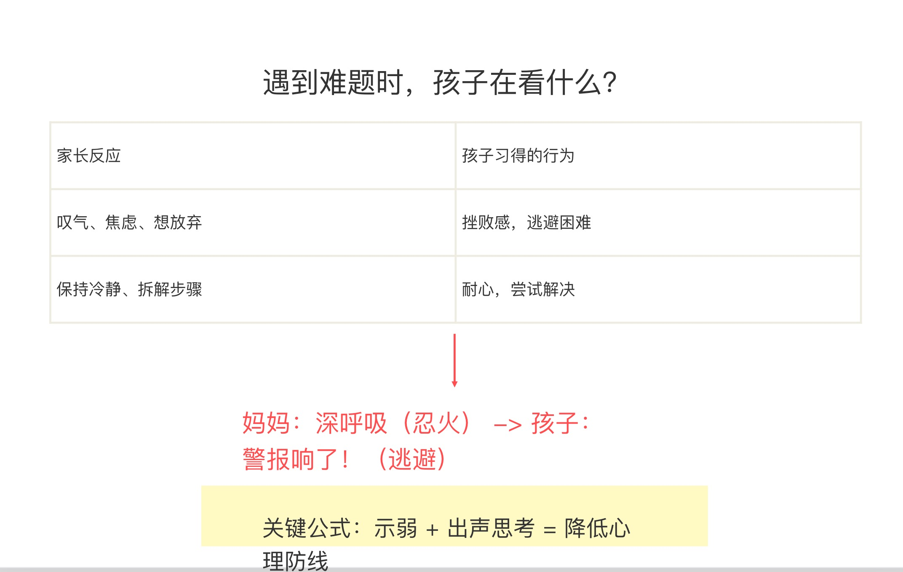
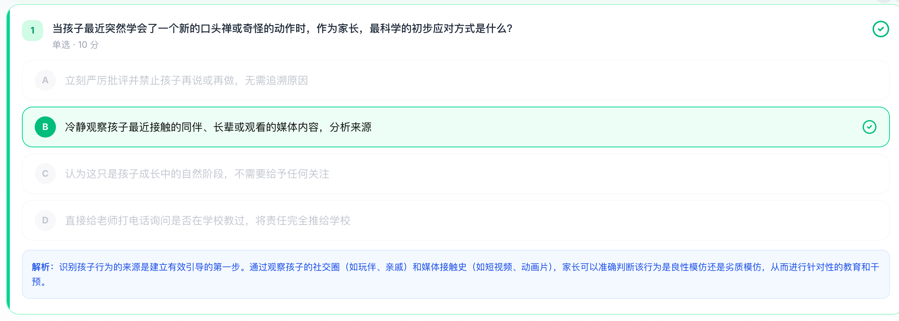
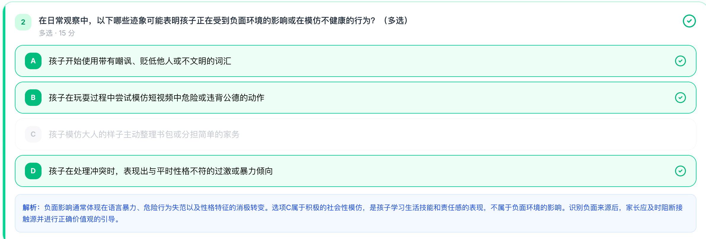
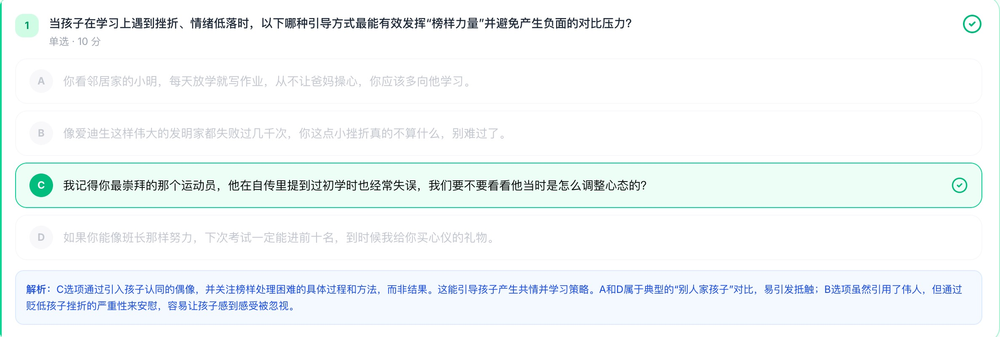
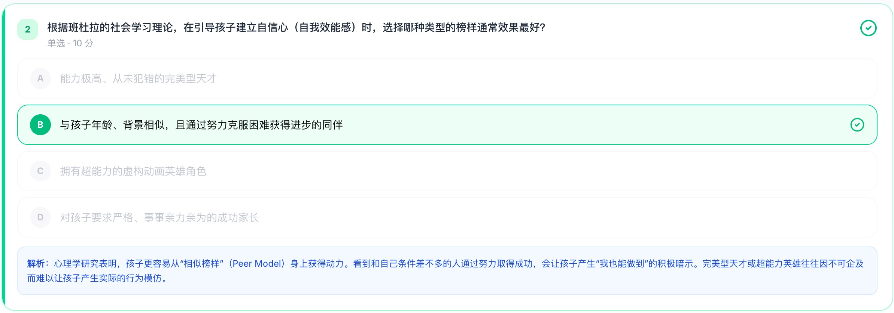
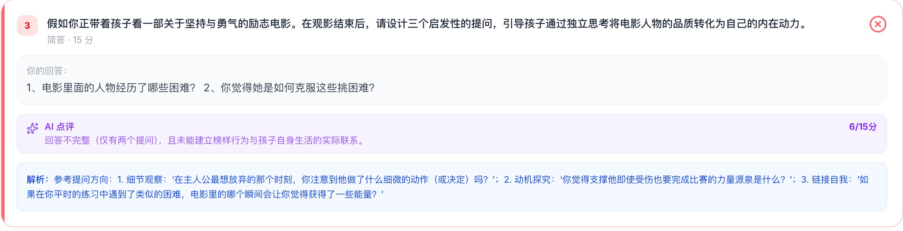
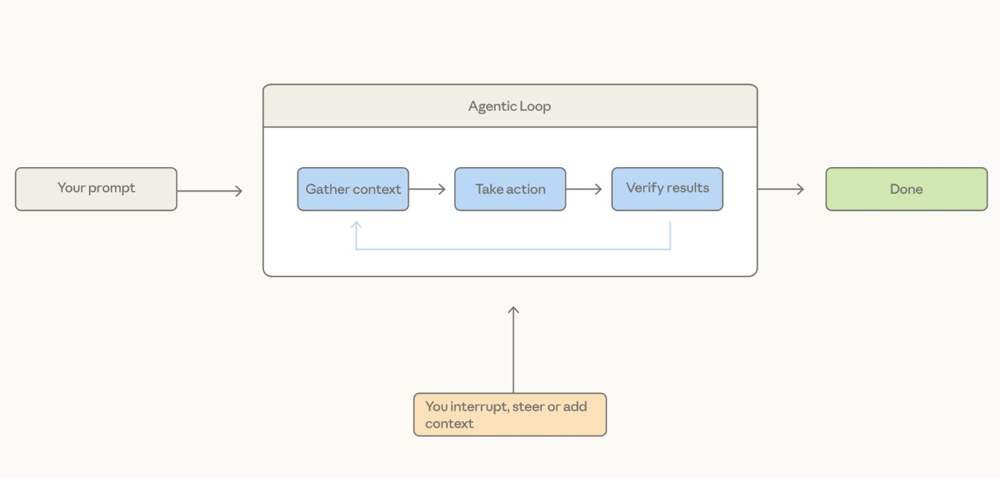

# 4月4日
## 将图片内容转换为mermaid图示


### ✅Qwen3.6-plus（还原度最高，几乎一样）


### ❌智普清言/豆包/deepseek/kimi


# 4月7日

## ✅一键升级agent工具脚本

```
npm i -g opencode-ai
npm i -g oh-my-opencode
npm install -g @anthropic-ai/claude-code
npm install -g @jackwener/opencli
npm install -g bb-browser
curl -fsSL https://pinchtab.com/install.sh | bash
npm install -g @tencent-ai/codebuddy-code
npx skills add tw93/Waza -g -y
npx skills add jackwener/opencli -g -y
npx skills add eze-is/web-access -g -y
npx skills update
```

## 删除opencli-operate技能

这个技能废弃了

```
npx skills rm -g opencli-operate
```

# 4月8日

## ✅编写后端skills

> skills是经验、方法论、踩过的坑的积累和输出，是编程思想的一种表现。

目前已经有一些积累，结合开源的后端skills，开始编写自己的后端skills。

> https://github.com/affaan-m/everything-claude-code/blob/main/skills/backend-patterns/SKILL.md
以上技能文件是nodejs、express框架、nextjs route技术栈。帮我转化为Java、springboot框架（3.1.1）、maven、mybatis-plus技术栈。

# 4月9日

## ✅skills删除了但是还在
问题：
continuous-learning-v2 opencli-rs这两个技能我把文件夹删除了，但是执行npx skills check 仍然显示这两个技能还在。

解决方法：
删除.agents/.skill-lock.json中这两个技能的记录，重新执行npx skills check 即可。

## ✅编写情感连接构建器

> 情感连接构建器是一个用于建立情感连接的工具，它可以帮助用户建立情感连接，建立情感连接，建立情感连接。

> skills/emotional-connection-builder/SKILL.md

## ✅思考情感联结课题

[工作回来太累不想沟通](../Emotional_Connection/工作回来太累不想沟通.md)
[情感连接与高情商沟通](../Emotional_Connection/情感连接与高情商沟通.md)
[如何与家人高效沟通](../Emotional_Connection/如何与家人高效沟通.md)
[与陌生人建立情感联结](../Emotional_Connection/与陌生人建立情感联结.md)

## ✅认真阅读10大热门skills/总结最佳实践

https://docs.trae.cn/ide/top-10-recommended-skills-for-development-scenarios

亮点：
- 代码审查技能审查的逻辑，可以复用到现有的项目中

## ✅阅读web-access skill文档

https://github.com/eze-is/web-access/blob/main/SKILL.md

> 它的浏览哲学是很好的提示词

### 浏览哲学

**像人一样思考，兼顾高效与适应性的完成任务。**

执行任务时不会过度依赖固有印象所规划的步骤，而是带着目标进入，边看边判断，遇到阻碍就解决，发现内容不够就深入——全程围绕「我要达成什么」做决策。这个 skill 的所有行为都应遵循这个逻辑。

**① 拿到请求** — 先明确用户要做什么，定义成功标准：什么算完成了？需要获取什么信息、执行什么操作、达到什么结果？这是后续所有判断的锚点。

**② 选择起点** — 根据任务性质、平台特征、达成条件，选一个最可能直达的方式作为第一步去验证。一次成功当然最好；不成功则在③中调整。比如，需要操作页面、需要登录态、已知静态方式不可达的平台（小红书、微信公众号等）→ 直接 CDP

**③ 过程校验** — 每一步的结果都是证据，不只是成功或失败的二元信号。用结果对照①的成功标准，更新你对目标的判断：路径在推进吗？结果的整体面貌（质量、相关度、量级）是否指向目标可达？发现方向错了立即调整，不在同一个方式上反复重试——搜索没命中不等于"还没找对方法"，也可能是"目标不存在"；API 报错、页面缺少预期元素、重试无改善，都是在告诉你该重新评估方向。遇到弹窗、登录墙等障碍，判断它是否真的挡住了目标：挡住了就处理，没挡住就绕过——内容可能已在页面 DOM 中，交互只是展示手段。

**④ 完成判断** — 对照定义的任务成功标准，确认任务完成后才停止，但也不要过度操作，不为了"完整"而浪费代价。

### 联网工具选择

- **确保信息的真实性，一手信息优于二手信息**：搜索引擎和聚合平台是信息发现入口。当多次搜索尝试后没有质的改进时，升级到更根本的获取方式：定位一手来源（官网、官方平台、原始页面）。

| 场景 | 工具 |
|------|------|
| 搜索摘要或关键词结果，发现信息来源 | **WebSearch** |
| URL 已知，需要从页面定向提取特定信息 | **WebFetch**（拉取网页内容，由小模型根据 prompt 提取，返回处理后结果） |
| URL 已知，需要原始 HTML 源码（meta、JSON-LD 等结构化字段） | **curl** |
| 非公开内容，或已知静态层无效的平台（小红书、微信公众号等公开内容也被反爬限制） | **浏览器 CDP**（直接，跳过静态层） |
| 需要登录态、交互操作，或需要像人一样在浏览器内自由导航探索 | **浏览器 CDP** |

浏览器 CDP 不要求 URL 已知——可从任意入口出发，通过页面内搜索、点击、跳转等方式找到目标内容。WebSearch、WebFetch、curl 均不处理登录态。

**Jina**（可选预处理层，可与 WebFetch/curl 组合使用，由于其特性可节省 tokens 消耗，请积极在任务合适时组合使用）：第三方网络服务，可将网页转为 Markdown，大幅节省 token 但可能有信息损耗。调用方式为 `r.jina.ai/example.com`（URL 前加前缀，不保留原网址 http 前缀），限 20 RPM。适合文章、博客、文档、PDF 等以正文为核心的页面；对数据面板、商品页等非文章结构页面可能提取到错误区块。

进入浏览器层后，`/eval` 就是你的眼睛和手：

- **看**：用 `/eval` 查询 DOM，发现页面上的链接、按钮、表单、文本内容——相当于「看看这个页面有什么」
- **做**：用 `/click` 点击元素、`/scroll` 滚动加载、`/eval` 填表提交——像人一样在页面内自然导航
- **读**：用 `/eval` 提取文字内容，判断图片/视频是否承载核心信息——是则提取媒体 URL 定向读取或 `/screenshot` 视觉识别

浏览网页时，**先了解页面结构，再决定下一步动作**。不需要提前规划所有步骤。

#### 程序化操作与 GUI 交互

浏览器内操作页面有两种方式：

- **程序化方式**（构造 URL 直接导航、eval 操作 DOM）：成功时速度快、精确，但对网站来说不是正常用户行为，可能触发反爬机制。
- **GUI 交互**（点击按钮、填写输入框、滚动浏览）：GUI 是为人设计的，网站不会限制正常的 UI 操作，确定性最高，但步骤多、速度慢。

根据对目标平台的了解来灵活选择方式。GUI 交互也是程序化方式的有效探测——通过一次真实交互观察站点的实际行为（URL 模式、必需参数、页面跳转逻辑），为后续程序化操作提供依据；同时当程序化方式受阻时，GUI 交互是可靠的兜底。

**站点内交互产生的链接是可靠的**：通过用户视角中的可交互单元（卡片、条目、按钮）进行的站点内交互，自然到达的 URL 天然携带平台所需的完整上下文。而手动构造的 URL 可能缺失隐式必要参数，导致被拦截、返回错误页面、甚至触发反爬。


## ✅agent skill是什么？

> agent skill 是什么？为什么 AI 会按照 skill 去执行？为什么有的时候不会按照 skill 执行？触发机制是什么？

- 是 AI 智能体（Agent）的模块化、可复用、可移植的专业能力包。
- 作用：把人类的 SOP、领域知识、工作流、工具用法，写成 AI 能读懂并执行的结构化指令。

典型结构：
```
my-skill/
├─ skill.md       # 核心：名称、描述、触发、步骤、格式
├─ references/    # 参考文档、政策、模板
├─ scripts/       # Python/Shell 等可执行脚本
└─ assets/        # 示例、Schema、素材
```

详细参见[关于skills的认知](./关于skills的认知.md)

## ✅skill的运行机制

> skill 的触发，是模型的能力？还是 agent 的能力？

[skill的运行机制](./skill的运行机制.md)

# 4月10日

## 🔥白嫖各家IDE最佳实践

- 国内模型，优先使用codebuddy-cn（workbuddy中可以签到领积分，相比trae-cn优势是不用排队等待）
- 国外模型，优先使用trae和antigravity（codebuddy国际版只有一个月体验，后续没有免费额度。不建议使用）

## 🔥付费各家IDE最佳实践

- 国内模型，优先使用trae-cn（pro版49元/月，相比codebuddy-cn的58元/月便宜）
- 国际模型，优先使用trae（lite版3美元/月，相比codebuddy国际版10美元/月便宜）

## ✅trae-cn定价计划


pro版49元/月

## ✅trae 定价计划


lite版，连续包月3美元，有5美元的使用量。

默认每月送3美元的使用量。如果不够，可以买这个连续包月的lite版。


## ✅codebuddy国内版定价


pro版本58元/月

且workbuddy中可以每天签到领取积分


## codebuddy国际版定价


pro版本10美元

## ✅cursor 定价计划


pro版本20美元，有点贵。

## ✅psychology-helper技能使用


```markdown
## 问题
好的，我的目的是想赚钱，想财富自由。想去赚钱呢，我就想着去大型互联网公司，所以最近刷了一段时间的leetcode，按照不同的模式循序渐进的刷了一段时间，可是已经停了一段时间了。另外想做自媒体。想把我们老婆给的工厂款（桑蚕丝T恤）卖掉。但是都没有实际搞起来。我前两年当了部门的技术主管也没给我加工资，让我有种只升职不加薪的挫败感和无力感。

## 回复

你的情况非常清晰了！让我用心理学帮你深度分析一下这个局面：

---

## 🎯 问题诊断

你面临的不是能力问题，而是**动机系统的冲突**：
- 想进大厂（刷 LeetCode）→ 但已中断
- 想做自媒体（卖桑蚕丝 T 恤）→ 但没开始
- 付出更多（当主管）→ 却没得到回报（没加薪）

这种"想做很多事但都启动不了"的状态，背后有深刻的心理学原因。

## 🧠 心理学原理

### 1. **实验 11 - 习得性无助** ⭐ 核心问题

你说"前两年当了部门技术主管也没给我加工资"——这才是关键！

心理学家塞利格曼发现：当狗经历无法逃避的电击后，即使后来门开了可以逃，它也不逃了，而是趴在地上哀嚎。**不是不能逃，是"学会"了逃不掉。**

**和你的关联**：
> 你付出了额外努力（当主管）→ 期待回报（加薪）→ 落空
> 
> 大脑学到的逻辑是：**"努力也没用，回报不可控"**
> 
> 于是刷 LeetCode、做自媒体这些事，你的潜意识在说："算了，反正努力了也不一定有回报"

**这不是懒，是大脑的自我保护机制。**

### 2. **实验 17 - 拖延实验**

心理学家发现，拖延的人不是没有时间观念，而是**被"未来自我"背叛过太多次**。

你想刷 LeetCode，但停了；想做自媒体，但没开始。为什么？

因为大脑在计算：
- "刷 LeetCode 要多久才能进大厂？" → 不确定
- "进大厂真能财富自由吗？" → 不确定
- "自媒体能做起来吗？" → 不确定

**不确定性 = 大脑的威胁信号** → 于是选择刷手机这种"确定的即时满足"

### 3. **实验 08 - 认知失调**

你说"想赚钱"但行为上"没实际搞起来"——这种认知和行为的差距会产生心理不适。

为了缓解这种不适，大脑会找理由：
- "最近太忙了"
- "还没准备好"
- "等孩子大一点再说"

**这些不是借口，是大脑在保护你免受"我言行不一致"的自我谴责。**

## 💡 行动建议

基于以上分析，我给你一套**反人性但有效**的策略：

---

### 🔥 短期（今天就能做）

#### 1. **承认"升职不加薪"的创伤**
拿出一张纸，写下：
```
我感到____（愤怒/委屈/失望），因为我付出了____，却得到了____。
这让我相信了____（关于努力/回报/职场的信念）。
```

**为什么要写？** 情绪被命名后，就失去了控制你的力量。你一直在用"刷 LeetCode 中断"来逃避面对这个创伤。

#### 2. **重新定义"财富自由"的目标**
问自己一个问题：
> "如果保证 3 年内财富自由，我最愿意投入哪条路？"
> - A. 进大厂（高薪但受雇于人）
> - B. 自媒体卖货（有风险但上限更高）
> - C. 两边都试试（精力分散但风险对冲）

**只能选一个。** 迷茫往往是因为"都想抓"，而人性是"贪多嚼不烂"。

---

### 📅 中期（本周开始）

#### 1. **选一条路，设定"止损点"**

**如果选大厂路线**：
- 每天刷 2 道 LeetCode，持续 3 个月
- 3 个月后必须投简历面试（不管准备得"够不够"）
- **关键**：设定明确的结果指标（拿到 offer 算成功，拿不到就切换路线）

**如果选自媒体卖货路线**：
- 这周拍 5 条桑蚕丝 T 恤的视频/照片
- 发小红书/抖音/朋友圈，测试市场反应
- **关键**：不要等"准备好了"，先发出第一个内容

#### 2. **和老婆做一次"财富对话"**
既然工厂款是老婆给的资源，和她认真聊一次：
- "我想认真做这件事，需要你支持____"
- "如果做起来，利润怎么分配？"
- "如果失败了，我们的底线是什么？"

**把模糊的"想做"变成具体的"承诺"**，这是对抗拖延的最强武器。

#### 3. **设计"即时反馈"机制**
大脑需要即时奖励，所以：
- 刷完 LeetCode→立刻打个勾，积累"连续打卡天数"
- 发出一条内容→记录阅读量，哪怕只有 10 个
- 卖出一件 T 恤→把利润截图存起来，建立"财富账户"

**用视觉化反馈欺骗大脑**，让它觉得"努力是有回报的"。

---

### 🌱 长期（持续练习）

#### 1. **重建"努力 - 回报"信念**

你需要的不是更多鸡汤，而是**亲眼看到"努力有回报"的证据**。

每周记录：
```
| 本周投入 | 具体行动 | 可见回报 |
|---------|---------|---------|
| 例：5h | 刷了 7 道 LeetCode | 连续打卡第 7 天 |
| 例：3h | 拍了 3 条视频 | 小红书涨粉 12 人 |
```

**回报不一定是钱**，任何正向反馈都算。坚持 3 个月，你的"习得性无助"会被重塑。

#### 2. **接受"斜杠"的现实**

你可能不需要"选一条路走到黑"，而是：
- 主业（大厂/现公司）→ 提供稳定现金流
- 副业（自媒体卖货）→ 提供财富自由的可能性

**不要试图一次性解决所有问题**，先用主业稳定心态，再用副业博上限。

#### 3. **重新谈判职场价值**

如果继续当主管：
- 和老板正式谈一次："我负责了主管的工作，希望薪资能匹配这个职责"
- 如果还是不加薪→把这段经历写进简历，跳槽是唯一解

**职场上，忠诚换不来回报，可替代性低才是王道。**

---

## 🌟 鼓励的话

兄弟，听我说：

你现在的状态，不是"懒"或"没毅力"，而是**被职场背叛过一次后的正常反应**。

但你也比很多人幸运：
- 你有技术能力（能当主管就是证明）
- 你有供应链资源（老婆的工厂款）
- 你有野心（想财富自由不是坏事）

**你缺的不是能力，是一个"重新开始相信"的理由。**

这个理由不会从天而降，它藏在你发出的第一条视频里、你投出的第一份简历里、你卖出的第一件 T 恤里。

**先动起来，再调整方向。** 站在原地想一万遍，不如走出去摔一跤。

---

*本建议基于经典心理学实验，仅供参考。如需深入了解，可以阅读《不要挑战人性》第 11 章"习得性无助"、第 17 章"拖延实验"。*

**你觉得自己更倾向哪条路？大厂还是自媒体？或者我们聊聊怎么设计一个"两边下注"的策略？**
```

# 4月11日

## ✅claude code所有环境变量

https://code.claude.com/docs/en/env-vars

## ✅设计skill

https://github.com/pbakaus/impeccable

## ✅多个开放和管理本地agent远程访问的工具

paseo（基于ghostty）
https://paseo.sh/

orca（一个以终端为主窗口的IDE,基于ghostty,可以拖拽文件）

https://github.com/stablyai/orca

https://github.com/a9gent/mindfs

pikiclaw（用不了，监测到了claude code和gemini cli，但是我多用不了。他配置的两个工具是亮点，可惜用不了。一个操作浏览器，一个操作本地app）

https://github.com/xiaotonng/pikiclaw


OpenContext（目前不好用，cpu会狂飙）

https://github.com/0xranx/OpenContext

# 4月12日

## qwen code config wechat channel

官网文档：
https://qwenlm.github.io/qwen-code-docs/zh/users/features/channels/weixin/
```bash
qwen channel configure-weixin
# 扫描二维码授权
```

编辑~/.qwen/settings.json

```json
"channels": {
     "my-weixin": {
       "type": "weixin",
       "senderPolicy": "pairing",
       "allowedUsers": ["*"],
       "sessionScope": "user",
       "cwd": "/Users/akm/Documents/note",
       "model": "qwen3.6-plus",
       "instructions": "You are a concise coding assistant responding via       WeChat. Keep responses under 500 characters. Use plain text only."
     }
   }
```

其中官网的"allowedUsers": []这个配置，我改成了"allowedUsers": ["*"]，这样就允许任何人使用这个channel了。否则在客户端发送第一条消息的时候，会提示需要执行配对命令。

接着运行``qwen channel start my-weixin``就可以在客户端发送消息了。

# 4月13日

## 模型差距的认知

首先，默认理解每个模型有每个模型的优缺点，然后再去对比。

现在讨论相同领域，不同模型的差距。

1、对话轮次
这方面的差距，好的模型，可以通过很少轮次的对话解答这个领域的问题，而差的模型，则需要很多轮次的对话才能解答这个领域的问题。

2、回答质量，
幻觉高低

差一点的模型，可以通过工程化+提示词，来减少对话轮次、和回答质量。（本质上，是在agent内部，做了多轮回答和优质提示词提示）

3、如何减少幻觉？
明确告诉AI，应该去哪里找答案，什么时候应该去哪里找答案，什么时候不应该去哪里找答案。

应该去找一手资料，比如官方文档，github仓库。

4、如何让工具调用更智能？

明确告诉AI，什么时候应该调用什么工具，什么时候应该尝试切换工具调用。

明确告诉AI，不应该在什么时机调用什么工具

## 一手资料整理

[AI一手资料来源](../AI一手资料来源.md)

[沉浸式翻译](https://x.com/immersivetran)

[玉伯](https://x.com/lifesinger)


# 4月14日

## 阅读《16种赚钱的方式，你却只选择了打工》


# 4月15日
## 续费百度网盘SVIP

之前是2024年6月26日续费的，现在2026年10月12日到期。
到6月有优惠再续一年。180左右，现在需要360元

百度网盘SVIP(1年)(2024年中庆)
2024-06-26 21:30:30


## AI课程
https://www.feimaoke.com/16067.html


# 4月16日

# 4月17日

## paseo or orca or workbuddy?

workbuddy

## ✅被动收入误区文章阅读

这篇文章的核心观点是：**“被动收入”作为创业信条，误导了一整代人**。

- 作者批评了 2015–2022 年间流行的“被动收入叙事”：很多人不再关注“解决真实问题”，而是只追求“睡后收入”和“系统自动赚钱”。
- 这种导向导致大量低价值项目泛滥：同质化 dropshipping 店、空洞联盟营销文章、课程套课程，表面像创业，实质上没有持续创造价值。
- 文章认为“可扩展性”本身没错，错在把“做出能规模化的好产品”偷换成“做任何能抽取现金的机制”。
- 后果是：创业者浪费多年时间在短期套利模式上，互联网内容质量被 SEO/联盟激励拉低，用户体验和信息质量整体恶化。
- 作者指出，真正长期有效的商业逻辑一直没变：**找到真实需求、持续交付价值、长期打磨信誉与关系**——这些都不“被动”，而是持续投入。
- 结论很直白：**“不想付出持续关心和投入”的心态，是糟糕商业的根源**；所谓“被动收入神话”本质上是对“无需在意用户”的幻想。

原文链接：  
[The "Passive Income" trap ate a generation of entrepreneurs](https://www.joanwestenberg.com/the-passive-income-trap-ate-a-generation-of-entrepreneurs/)

# 4月20日

## 一些关于身体的认知

舌头在嘴巴里绕圈

眼睛闭着绕圈

不吃糖果。糖果会消耗虹膜依赖的B族维生素。容易引起近视。

睡觉，能够让身体自己恢复到最佳状态。

踮脚尖，拉伸，能够让身体具有柔韧性，能够降低拉伤的可能。

做俯卧撑、仰卧起坐，锻炼腹肌核心，能够降低身体腰间盘突出、脊柱弯曲的可能。

## AI agent响应机制

在qwen上配置了一些规则，问了他的响应机制。以下是回复。

我的响应机制遵循以下核心逻辑，按优先级执行：

### 1️⃣ 问题分类 → 匹配策略
| 问题类型 | 响应策略 |
|---------|---------|
| 简单事实/定义 | 直接给出答案，不展开 |
| 复杂/模糊/多意图 | 先澄清需求 → 多轮确认 → 分步解答 |
| 需外部信息 | 调用 `web_search`/`web_extractor/web-access/bb-browser/opencli/pinchtab` 获取事实|
| 涉及代码/计算 | 使用 `code_interpreter` 验证后输出 |

### 2️⃣ 内容生成原则
- **简洁至上**：能一句话说清，绝不写三段（KISS）
- **事实校验**：不确定时明确标注「推测」，优先引用可验证来源
- **结构化输出**：复杂内容用列表/表格/步骤拆解，便于快速扫描
- **中文优先**：思考过程与最终输出均使用中文

### 3️⃣ 上下文管理
- 自动关联当前对话历史（`history_retriever`）
- 上下文不足时，主动提供 2-3 个可选方向供你确认
- 记住你的偏好（如杭州、软件专家背景），但仅在相关时隐式应用

### 4️⃣ 迭代协作
```
理解需求 → 方案构思 → 请你审核 → 分解任务 → 执行交付
```
任何环节存疑，我会暂停并请求反馈，而非假设推进。

> 💡 简单总结：**先判断问题复杂度，再匹配最小必要响应，全程保持可验证、可迭代、可打断。**

有具体场景想测试这个机制吗？我可以现场演示。

## 写作业畏难问题

> 如何通过榜样学习，激发8岁孩子认真做作业，主动独立思考问题，解决问题的能力？
> 1、比如，老师布置的数学作业，我已经告诉她，不会的翻翻课本的练习，作业都是课本的练习修改后的。可是她还是说自己不会。
> 2、我说深呼吸，再想想试试，她非常不耐烦，不愿意尝试

遇到难题时，孩子在看什么


奇怪动作模仿的动机



模仿负面、不健康的行为的动机


避免负面对比


如何运用榜样引导孩子建立自信系


转化为自身内在动力的启发性提问


## 人月神话经验解读

借助notebooklm。

《人月神话》基于 OS/360 等大型软件项目的开发经验，传授了关于软件工程管理、团队组织和系统设计的核心经验。以下是该书传授的主要经验：

### 1. 关于进度与管理的“人月神话”
*   **布鲁克斯法则（Brooks's Law）：** 向进度落后的项目中增加人手，只会导致进度更加落后。
*   **人月不可互换：** 成本随开发人数和时间的乘积变化，但进度并非如此。**由于任务之间的次序限制和沟通成本，人手与时间无法直接等量替换**。
*   **盲目乐观的危害：** 程序员通常假设一切都会运行良好，并以此估算进度，但构想本身是有缺陷的，必然会产生 bug。
*   **合理的进度安排：** 建议将 1/3 的时间用于计划，1/6 用于编码，1/4 用于构件测试，**1/4 用于所有构件完成后的系统测试**。

### 2. 团队组织与效率
*   **外科手术队伍（Surgical Team）：** 提倡由一名首席程序员（外科医生）主导设计和编码，其他人提供专业化支持（如副手、管理员、编辑、工具维护者等），以**兼顾大型项目的效率和设计的连贯性**。
*   **沟通的代价：** 交流是项目成功的关键，但交流的开销会随人员数量呈二次方增长，因此**良好的团队组织应尽量减少交流接口**。

### 3. 系统设计与质量
*   **概念完整性（Conceptual Integrity）：** 这是系统设计中最重要的考虑因素。为了反映连贯的设计思路，宁可省略一些不规则的功能，也必须保持设计的一致性。
*   **画蛇添足（第二系统效应）：** 架构师在设计第二个系统时往往最危险，因为他们会倾向于加入所有在第一个系统中被迫放弃的修饰功能，导致系统臃肿。
*   **体系结构与实现分离：** 架构是完整且详细的用户接口说明，应与具体的物理实现区分开来，以保证用户利益和设计的简洁。

### 4. 开发流程与文档
*   **未雨绸缪（Plan to Throw One Away）：** 无论你是否愿意，第一个开发的系统总是无法使用。**你应该预先计划放弃原型，并为后续的重新设计做好准备**。
*   **为变更设计系统：** 变化是永恒的。应使用高级语言、子程序库和自文档化技术来提高系统的灵活性，以应对不可避免的需求变更。
*   **提纲挈领的文档：** 项目经理应维护极少数的核心文档（如目标、规格说明、进度表、预算等），它们是项目管理围绕运转的关键枢纽。
*   **自文档化程序：** 提倡将文档整合到源程序中，通过良好的代码结构、注释和格式提高程序的可读性，从而保证文档的及时更新。

### 5. 调试与里程碑管理
*   **自下而上的设计与测试：** 提倡采用结构化编程和精化步骤，从顶层到底层逐步细化，以减少 bug 的产生。
*   **祸起萧墙：** 项目的延迟是“一天一天累积出来的”。**里程碑必须是具体的、特定的、可度量的事件**，以避免慢性的进度偏离。

想要深入了解哪方面的经验？例如，我可以为您详细介绍“外科手术队伍”的具体分工。

## 在复杂的软件系统中，为什么保持概念完整性如此重要？

在复杂的软件系统中，**保持概念完整性（Conceptual Integrity）被认为是系统设计中最重要的考虑因素**。其重要性主要体现在以下几个维度：

### 1. 决定系统的易用性与简洁性
系统的目的通常是使计算机更易于使用。**概念完整性直接决定了系统的易用程度**。
*   **简洁与直白：** 简洁并非仅仅指功能少，而是指功能与概念复杂度的比值要大。只有当系统表现出一致的设计理念，用户才能更容易地预测系统行为、寻找特定功能并记住选项。
*   **一致的原则：** 系统的每一个部分都必须反映相同的原理和权衡，在语法和语义上保持一致。

### 2. 提高开发效率与系统质量
虽然维持概念完整性可能需要由少数人（甚至一个人）来主导架构设计（所谓的“贵族专制”），但这种做法实际上会加速开发进程。
*   **简化交流：** 相比于每个人都在接口和设计路线上争论不休，统一的体系结构极大简化了团队成员间的交流。
*   **缩短测试时间：** 经验显示，具备高度概念完整性的系统开发更快，需要的测试时间也更少。

### 3. 降低维护和调试成本
缺乏概念完整性会给软件项目带来灾难性的代价：
*   **调试陷阱：** 许多致命且难以察觉的 bug 源于不同开发者对系统组成部分所做的匹配假设不一致。
*   **高昂的修改开销：** 概念完整性的缺失会导致系统在开发和后续修改中付出更昂贵的代价。例如，在 OS/360 的案例中，这被估计导致增加了长达一年的调试时间。

### 4. 防止“画蛇添足”与过度设计
保持概念完整性要求架构师具备自律意识，尤其是在开发第二个系统时。通过坚持统一的基本理念，可以避免向系统添加过多的修饰功能和不兼容的构想，从而防止系统变得臃肿且难以驾驭。

总之，**为了反映一系列连贯的设计思路，宁可省略一些不规则的特性和改进，也不应该接受一个独立且无法整合的系统**。概念完整性是保证软件产品从简单的“程序”演变为真正有用的“编程系统产品”的核心。

## 介绍“外科手术队伍”的具体分工

在《人月神话》中，作者弗雷德里克·布鲁克斯引用了 Harlan Mills 的建议，提出了一种类似于**外科手术队伍**的软件开发团队组织方式。这种结构旨在通过高度专业化的分工，既能保证大型项目所需的开发人力，又能维持系统设计的**概念完整性**。

以下是该团队（通常建议为 10 人规模）的具体分工：

### 1. 核心设计与开发角色
*   **外科医生 (Surgeon)：** 即**首席程序员**。他是团队的灵魂，亲自定义系统功能和性能技术说明书，设计程序，编制源代码，进行测试并撰写技术文档。他负责所有的设计和全部代码，以保证概念的一致性。
*   **副手 (Copilot)：** 是外科医生的后备和潜在继任者。他可以完成任何一部分工作，但经验相对较少。其主要作用是作为外科医生的**思考者、讨论者和评估人员**，研究设计方案的备选项，甚至编制部分代码，但不承担具体的开发职责。

### 2. 专业支持角色
*   **管理员 (Administrator)：** 负责非技术事务，如人员、薪酬、办公空间等。他是外科医生的“老板”，负责处理财务、行政以及与组织中其他管理机构的接口工作，从而确保外科医生不被这些杂事分心。
*   **编辑 (Editor)：** 负责**文档的生成和维护**。外科医生撰写草稿或口述，由编辑进行分析、重新组织、提供参考信息、进行版本维护，并监督文档的最终产出。
*   **程序职员 (Program Clerk)：** 负责维护团队所有技术记录。他负责管理程序库（包括机器可读文件和人工可读文件），对运行情况进行记录和归档。这一分工使程序员能从繁琐的文书工作中解脱出来。
*   **工具维护人员 (Toolsmith)：** 确保团队拥有高效的开发工具（如编辑器、调试器等）。他负责根据外科医生的需求维护、升级或开发专门的实用程序和函数库。
*   **测试人员 (Tester)：** 负责根据外科医生的代码片段和整个系统编写测试用例，制定测试计划并搭建测试平台。他是外科医生设计思路的“对手”，也是日常调试的助手。
*   **语言专家 (Language Specialist)：** 掌握复杂编程语言深层特性的专家。他研究如何用语言最简洁、高效的方法解决棘手问题。一名语言专家通常可以同时为 2-3 个外科手术队伍服务。

### 3. 行政辅助
*   **两个文秘 (Secretaries)：** 管理员和编辑各需要一名文秘，负责处理非产品文件和项目协作事务。

这种组织架构的核心在于：**系统是由一两个人（外科医生和副手）思考的产物**，这在客观上保证了设计的**概念完整性**，同时其他专业人员的支持确保了团队的高产出率。

您想了解这种“外科手术队伍”在大规模项目（如需要几百人参与）中是如何进行扩展协作的吗？

## ✅如何管理技术团队

“Linus 定律”——即“只要眼睛多，bug 容易捉”——强调了大规模同行评审在提升软件质量与稳定性上的关键作用

> 多人code review

形式：周会的形式，分享自己本周的设计、code、解决的bug的过程，大家一起进行review。提炼经验、总结，写入周报。

优点1:周会的这个过程，可以增进大家的沟通，看似浪费时间，实际减少大家的沟通壁垒，让每个人的工作都能被看见和理解。满足大家的分享欲。增加团队交流机会。

优点2:每个人的思维都是不同的，存在思维定势，别的人可能很容易发现你的问题。所以，更容易提高软件工程质量，从而进一步驱动大家共同进步。

## 阅读《16种赚钱的方式，你却只选择了打工》

## 阅读《税后收入的真相》


## 关键词：天涯神贴

值得一看


## 编写一个agent cli工具

agent的架构，本质是一个[agent loop](https://anthropic.skilljar.com/claude-code-101/469789)




