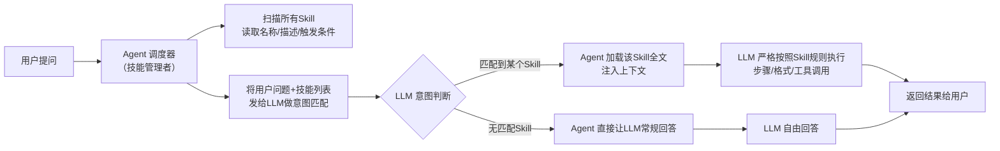
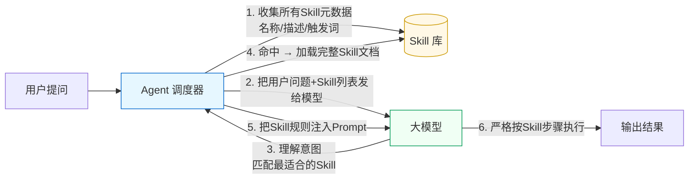

直接给你**最清晰、最本质的结论**：

# 结论
**Skill 的触发 = Agent 的能力，不是模型本身的能力。**
模型只负责**理解、推理、执行**，不负责“要不要触发 Skill”。

---

# 详细拆开说

## 1. 模型（LLM）本身不负责“触发 Skill”
大模型（GPT、Claude、Llama 等）本质只有一个能力：
**根据上下文，预测下一个 token。**

它不知道：
- 有哪些 Skill 存在
- Skill 存在哪个目录
- 什么时候该加载哪个 Skill
- 怎么把 Skill 注入上下文

这些**都不属于模型能力**。

模型能做的只是：
- 看懂你给它的 Skill 规则
- 按照规则去执行
- 判断用户意图是否匹配某个 Skill 描述

但**“是否触发、何时触发、加载哪个”**不归它管。

---

## 2. Skill 触发 = Agent 系统的调度能力
Agent（智能体框架）才是真正的“指挥官”，它负责：

1. **扫描所有 Skill**
   读取 skill.md、元数据、触发条件、描述。

2. **构建路由表**
   把所有 Skill 变成一个“可匹配列表”。

3. **接收用户输入**
   传给模型做意图理解。

4. **根据模型返回的意图，匹配并选择 Skill**
   这一步叫 **Skill Routing / Skill Selection**。

5. **将匹配到的 Skill 注入上下文**
   再把完整 prompt 丢给模型去执行。

所以：
- **触发 = Agent 的调度逻辑**
- **执行 = 模型的理解能力**

---

## 3. 为什么有时候“像模型自己触发的”？
因为很多 Agent 框架会用一种**伪触发方式**：

- 把所有 Skill 描述塞进系统提示
- 让模型自己判断“我应该用哪个 Skill”
- 模型输出类似：
  `[Skill: 代码审查]`
- Agent 检测到标记 → 真正加载 Skill

看起来像模型触发，
**本质还是 Agent 在监听关键词、做调度。**

---

## 4. 一句话终极总结
- **Skill 触发：Agent 的能力（路由、选择、加载）**
- **Skill 理解与执行：模型的能力**
- 模型不决定“要不要用 Skill”，只决定“用了之后怎么做”。

---

如果你愿意，我可以给你画一张 **Agent → Skill → LLM** 的极简流程图，一眼看懂整个机制。

图示一：

图示二：

### 一句话看懂流程
1. **Agent 管“选技能”**（触发、调度、加载）
2. **LLM 管“用技能”**（理解、执行、输出）
3. 技能能不能触发，**完全看 Agent**，不看模型本身

## 用**超简短白话版**，再总结一遍核心逻辑

- **Agent**：负责**找技能、触发技能、把技能塞给模型**
- **Skill**：给 AI 定好的**做事规矩/步骤**
- **LLM**：只负责**看懂技能，照着执行**
- 不听话大多是：没触发对技能、规矩写得模糊、模型没遵守